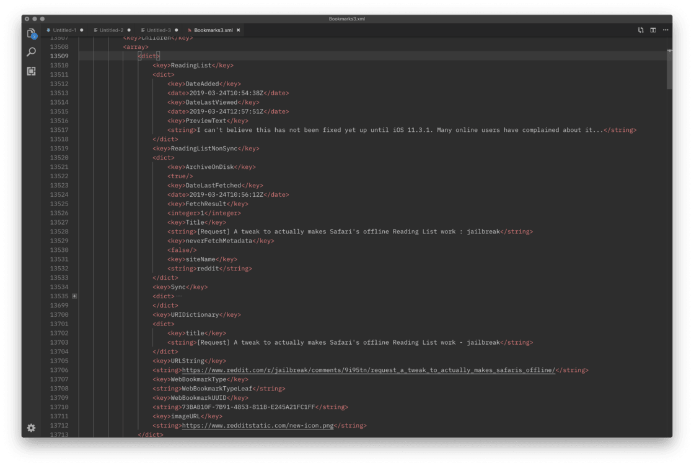

# iOS系统架构（三）App启动流程分析与优化

### 背景知识：

* mach-o文件为基于Mach核心的操作系统的可执行文件、目标代码或动态库，是.out的代替，其提供了更强的扩展性并提升了符号表中信息的访问速度，
* 符号表，用于标记源代码中包括标识符、声明信息、行号、函数名称等元素的具体信息，比如说数据类型、作用域以及内存地址，iOS符号表在dSYM文件中
* 程序构建过程：编译分三步走，对 源文件进行预处理\(processing\)，处理预编译指令，生成.i文件，下一步进行编译，进行词法分析\(lex工具识别词法规则语义表\)、语法分析和语义分析生成.s汇编文件，最后进行汇编，生成二进制目标文件.o。目标文件再进行链接器链接，形成可执行文件.a或mach-o文件。
* 链接分为动态链接和静态链接，静态链接会将所有目标文件.o全部内容链接到执行文件中，如果另外的执行文件需要其中的功能，也必须全部收录。动态链接为了解决这样的空间浪费问题，只将函数信息链接加入执行文件
* dyld是加载动态链接库的库，该库在加载可执行文件的时候，递归加载所需要的所有动态库。动态库包括iOS操作系统的系统framework，oc的runtime系统libobjc，系统级别的库libSystem，例如libdispatch（GCD）、libsystem\_block（Block）

### App启动大致流程

App 启动的方式分为**冷启动**和**热启动**两种。简单来说，冷启动发生时后台是没有这个应用的进程的，程序需要从头开始，经过漫长的准备和加载过程，最终运行起来。而热启动则是在后台已有该应用进程的情况下发生的，系统不需要重新创建和初始化。因此，从技术视角讨论启动治理时，主要针对冷启动。

对于一个可执行文件来说，它的加载过程是： 分为两大部分：

1. **pre-main** 指的是操作系统开始执行一个可执行文件，并完成进程创建、执行文件加载、动态链接、环境配置
2. **main** 指的是从加载main函数入口以后，到app delegate完成加载回调的过程


pre-main 基本流程：

App 开始启动后，系统首先加载可执行文件（自身 App 的所有 .o 文件的集合），然后加载动态链接器 dyld，dyld 是一个专门用来加载动态链接库的库。 

执行从 dyld 开始，dyld 从可执行文件的依赖开始，递归加载所有的依赖动态链接库。 动态链接库包括：iOS 中用到的所有系统 framework，加载 OC runtime 方法的 libobjc，系统级别的 libSystem，例如 `libdispatch(GCD)` 和 `libsystem_blocks (Block)`。

### 操作系统加载App可执行文件

操作系统加载可执行文件，通过fork（创建一个进程）指令在新的空间内来执行可执行文件，加载依赖的可执行文件\(mach-o\)文件，定位其内部与外部指针引用，例如字符串与函数，执行声明为`attribute((constructor))`的C函数，加载扩展\(Category\)中的方法，C++静态对象加载，调用ObjC的`+load`函数

### dyld加载动态库

动态链接库的加载过程主要由dyld来完成，dyld是苹果的动态链接器。


1. 系统先读取App的可执行文件（Mach-O文件）里的mach-o headers
2. dyld去初始化运行环境，从里面获得动态依赖，开启缓存策略，加载程序相关依赖库\(其中也包含我们的可执行文件\)，并对这些库进行链接，最后调用每个依赖库的初始化方法，在这一步，runtime被初始化。当所有依赖库的初始化后，轮到最后一位\(程序可执行文件\)进行初始化。
3. 检查和确认符号表的是否存在和正确
4. Map所有mach-o文件，用来整体统计变量声明、函数调用等信息
5. 进行bind操作，对从其他库的引用的符号、函数等，进行其内存地址进行修正绑定
6. 进行rebase操作，对自身库内部的引用进行修正
7. 进行runtime系统初始化，会对项目中所有类进行类结构初始化，然后调用所有的load方法。
8. 最后dyld返回main函数地址，main函数被调用，我们便来到了熟悉的程序入口。 当加载一个 Mach-O 文件 \(一个可执行文件或者一个库\) 时，动态链接器首先会检查共享缓存看看是否存在其中，如果存在，那么就直接从共享缓存中拿出来使用。每一个进程都把这个共享缓存映射到了自己的地址空间中。这个方法大大优化了 OS X 和 iOS 上程序的启动时间。

### Mach-O 镜像文件

官方文档：[developer.apple.com/library/arc…](https://link.juejin.im/?target=https%3A%2F%2Fdeveloper.apple.com%2Flibrary%2Farchive%2Fdocumentation%2FPerformance%2FConceptual%2FCodeFootprint%2FArticles%2FMachOOverview.htm)

Mach-O是OS X中二进制文件的本机可执行格式，是传送代码的首选格式。可执行格式确定二进制文件中的代码和数据被读入内存的顺序。代码和数据的排序会影响内存使用和分页活动，从而直接影响程序的性能。段的大小通过其包含的所有段中的字节数来度量，并向上舍入到下一个虚拟内存页边界。 Mach-O二进制文件被组织成segements。每个segement包含一个或多个部分。每个部分都有不同类型的代码或数据。segement始终从页面边界开始，但section不一定是页面对齐的。因此，segement终是4096字节或4千字节的倍数，其中4096字节是最小大小。 Mach-O可执行文件的segement和section根据其预期用途命名。segement名称的约定是使用以双下划线开头的全大写字母（例如，TEXT）。 **section名称的约定是使用以双下划线开头的全小写字母（例如，**text）。 Mach-O可执行文件中有几个可能的segements，但只有两个与性能有关：\_\_TEXT段和\_\_DATA段。

The \_\_TEXT Segment: Read Only \_\_TEXT segment是包含可执行代码和常量数据的只读区域。按照惯例，编译器工具创建具有至少一个只读\_\_TEXT segment的每个可执行文件。由于该段是只读的，因此内核可以将\_\_TEXT segment直接从可执行文件映射到内存中一次。当segment被映射到内存时，它可以在所有进程之间共享其内容。 （这主要是框架和其他共享库的情况。）只读属性还意味着构成\_\_TEXT segment的页面永远不必保存到后备存储。如果内核需要释放物理内存，它可以丢弃一个或多个\_\_TEXT页面，并在需要时从磁盘重新读取它们。 \_\_TEXT segment的主要部分,sections分布

* \_\_text 已编译的可执行文件的机器代码
* \_\_const 一般的常量数据
* \_\_cstring 文字字符串常量（源代码中的引用字符串）
* \_\_picsymbol\_stub 动态链接器（dyld）使用的与位置无关的代码存根例程

The \_\_DATA Segment: Read/Write \_\_DATA segment 包含可执行文件的非常量变量。该 segement 是可读写的，因为它是可写的，所以对于与库链接的每个进程，逻辑上复制静态库或其他动态共享库的\_\_DATA段。当内存页面可读写时，内核会使其变为copy-on-write。此技术可以做到，动态库是在内存中共享的，可以被其他各个进程访问，但因为\_\_DATA Segment是可读可写的，就会通过某一进程对共享的\_DATA Segment有写操作的时候，再进行单独的\_DATA内存空间复制。 \_\_DATA segment 有许多部分，其中一些仅由动态链接器使用。下面 列出了可以出现在\_\_DATA segment 中的一些更重要的部分。有关段的完整列表，请参阅Mach-O运行时体系结构。

* \_\_data 初始化的全局变量（例如int a = 1;或static int a = 1;）。
* \_\_const 需要重定位的常量数据（例如，char \* const p =“foo”;）
* \_\_bss 未初始化的静态变量（例如，static int a;）。
* \_\_common 未初始化的外部全局变量（例如，int a;外部功能块）。
* \_\_dyld 占位符部分，由动态链接器使用。
* \_\_la\_symbol\_ptr lazy符号指针。可执行文件调用的每个未定义函数的符号指针。
* \_\_nl\_symbol\_ptr 非lazy符号指针。可执行文件引用的每个未定义数据符号的符号指针。

Mach-O 性能影响 Mach-O可执行文件的\_\_TEXT segment和\_\_DATA segment的组成与性能有直接关系。优化这些sections的技术和目的是不同的。但是，它们的共同目标是：提高内存使用效率。

最典型的Mach-O的文件由可执行代码组成，在\_\_TEXT，\_\_text当中。如\_\_TEXT segment，该\_\_TEXT是只读的，并直接映射到可执行文件，所以如果内核需要回收某些\_\_text页面占用的物理内存，就不必将页面保存到back store再将其分页。它只需要释放内存，并在后面代码引用的时候从磁盘重新读回。虽然这比交换内存分页的成本低，因为这只是一个磁盘访问，而不是两个内存分页的交换 ， 但这仍然很损耗性能，特别是如果必须从磁盘重新创建许多页面。

对于这种情况的改进，是通过程序重新排序来改进代码的引用位置，如改进参考位置中所述。该技术将方法和功能组合在一起，具体取决于它们的执行顺序，调用频率以及它们相互调用的频率。如果\_\_text部分组中的页面以这种方式逻辑上起作用，则它们不太可能被多次释放和读回。例如，如果将所有启动时初始化函数放在一个或两个页面上，则在发生初始化后不必重新创建页面。

与\_\_TEXT段不同，\_\_DATA可以写入段，因此段中的页面\_\_DATA不可共享。框架中的非常量全局变量可能会对性能产生影响，因为与框架链接的每个进程都会获得这些变量的副本。解决这个问题的主要解决办法是尽可能多的非恒定的全局变量尽可能转移到\_\_TEXT，\_\_const通过宣布他们部分const。减少共享内存页面描述了此技术和相关技术。这通常不是应用程序的问题，因为应用程序中的\_\_DATA部分不与其他应用程序共享。

编译器将不同类型的非常量全局数据存储在段的不同部分中\_\_DATA。这些类型的数据是未初始化的静态数据和符号与未声明的“暂定定义”的ANSI C概念一致extern。未初始化的静态数据位于\_\_bss段的\_\_DATA部分中。暂定的符号在\_\_common 该\_\_DATA部分。

该 ANSI C和 C ++标准指定系统必须将未初始化的静态变量设置为零。（未初始化的其他类型的未初始化数据。）由于未初始化的静态变量和临时定义符号存储在单独的部分中，因此系统需要以不同方式对待它们。但是当变量位于不同的部分时，它们更有可能最终出现在不同的内存页面上，因此可以单独进行交换，从而使代码运行速度变慢。如减少共享内存页面中所述，这些问题的解决方案是在段的一个部分中合并非常量全局数据\_\_DATA。

### ObjC Runtime

dyld的加载过程会初始化Runtime系统，在此阶段，有相当多的优化工作可以做


这过程包括：

1. 所有类型的定义和注册，Objective-C的类不是编译器决定的，是运行时动态载入到全局表中的
2. 非脆弱的ivars变量抵消更新，修改实例变量的内存地址偏移问题
3. 分类替换并添加到方法列表中，将分类中的方法加载到方法列表中
4. 确认选择器全局唯一

### Initializers 阶段

在Runtime系统加载以后，开始进行初始化



1. Objc的+load\(\)函数
2. C++的构造函数属性函数 形如attribute\(\(constructor\)\) void DoSomeInitializationWork\(\)
3. 非基本类型的C++静态全局变量的创建\(通常是类或结构体\)\(non-trivial initializer\) 比如一个全局静态结构体的构建，如果在构造函数中有繁重的工作，那么会拖慢启动速度

### pre-main阶段总结分析

从上面可以得出以下几个结论，影响该阶段启动时间的因素如下：

1. Mach-O可执行文件的加载和内存重新分配规划，对于其segment和section进行虚拟内存的分页管理的调度
2. dyld动态链接内存中的公共镜像，在运行时进行检查共享数据和链接调用
3. Runtime的初始化，包括class注册、category加载、变量对齐等
4. C++静态对象和全局变量的加载
5. ObjeC所有load函数的调用加载

#### 优化措施：

1. 减少ObjC的类膨胀问题，清理没有使用的类，合并松散无用的类
2. 减少静态变量的声明和初始化的分离

```c
static int x;
static short conv_table [128];
//更换为
static int x = 0;
static short conv_table [128] = {0};
复制代码
```

减少静态变量的使用 3. 减少符号表的导出 通过设置-exported\_symbols\_list或-unexported\_symbols\_lis来限制符号表的导出，从而减少dyld的工作量 4. 去除没有使用的动态库依赖，明确所依赖的frameworks是require还是optional，optional会动态进行额外检查 5. 删除没有用的方法 6. 减少+load函数的实现，并减少在其中操作的逻辑 7. 对某些经常调用的代码进行二进制化，生成静态库，多使用静态库代替动态库，将多个静态库框架，集中制作成静态framework，从而能够减少dyld的链接工作 关于冷启动和热启动的不同如下：


### main阶段


从上图可以得到，影响main阶段的启动时间因素是：

1. AppDelegate代理的加载生命周期回调
2. Application Window的布局、绘制和加载
3. RootViewController的加载 优化点：
4. 压缩和减小启动图片
5. 尽量不使用storyboard或者是nib来布局rootViewController
6. 在didFinishLaunchingWithOptions阶段，尽可能减少阻塞代码的执行，可以利用多线程进行加载逻辑的处理，注意多线程对主线程同步阻塞可能造成的黑屏问题
7. 将非同步需求的初始化逻辑进行异步加载

#### 用户视角

iOS App 是面向终端用户的产品，因此衡量启动的最终标准还是要从用户视角出发。

从用户视角定义启动，主要以用户主观视觉为依据，以页面流程为标准。这样看来，常见的 App 启动可以分为三个阶段：


**T1：闪屏页**

* 闪屏页是启动过程中的静态展示页。在冷启动的过程中，App 还没有运行起来，需要经历环境准备和初始化的过程。这个过渡阶段需要展示一些视图，供阻塞等待中的用户浏览。
* iOS 系统 \(SpringBoard\) 根据 App Bundle 目录下的 Info.plist 中"Launch screen interface file base name"字段的值，找到所指定的 xib 文件，加载渲染展示该视图。
* 闪屏页的展示是系统行为，因此无法控制；加载的是 xib 描述文件，无法定制动态展示逻辑，因此是静态展示。
* 对应技术启动阶段的 pre-main 阶段

**T2\(可选\)：欢迎页（广告）**

* App 运行后根据特定的业务逻辑展示的第一个页面。常见的有广告页和装机引导流程。
* 欢迎页是业务定制的，因此可根据业务需要优化展示策略，该阶段本身也是可选的。

**T3：目标页\(落地页\)**

* App 启动的目标页。
* 可以是首页或特定的落地页
* 目标页的加载渲染渲染完成标志着 T3 阶段的结束，也标志着启动流程的结束。

### 0X1 方法论及关键指标

#### APM 方法论

对 iOS 启动的治理，本质上是对应用性能优化 \(App Performance Management\) 的过程，其基本的方法论可以归纳为：

**界定问题**

* 准确描述现象，确定问题的边界
* 确定量化评价手段，明确关键指标

**分析问题**

* 分析问题产生的主要原因，根本原因
* 确定问题的重要性，优先级
* 性能问题可能是单点的短板，也可能是复杂的系统性问题，切忌「头痛医头，脚痛医脚」。要严谨全面地分析问题，找到主要原因、根本原因予以优先解决

**解决问题**

* 确定解题的具体技术方案
* 根据关键指标量化成果
* 对问题进行总结，积累沉淀

**持续监控**

* 性能问题是持续的，长期的
* 对关键技术指标建立长效的监控机制，确保增量能被及时反馈，予以处理

#### 关键指标

**1. 启动耗时**

启动耗时是衡量启动性能的核心指标，因为它直接影响了用户体验并对用户转化率产生影响。

对启动耗时指标的拆解有助于细粒度地监控启动过程，帮助找到问题环节。具体可以拆解为：

* **技术启动耗时指标**
  * pre-main
  * core-postmain
* **主观启动耗时指标**
  * T1\_duration  ：从程序运行起点到主视窗可见
  * T2\_duration
  * T3\_duration
  * total\_duration

根据对马蜂窝 App 用户的行为数据分析确认，我们得到以下结论：

* 启动耗时和启动流失率正相关
* 启动耗时和次日留存负相关

**2.启动流失率**

**1\). 如何定义启动流失**

用户视角的启动流程完成前（即目标页渲染完成前），用户主动离开 App\(进入后台，杀死 App, 切换到其他 App 等\)，记做**一次启动流失**。

启动流失率计算公式为：

* 启动 PV 流失率：启动流失 PV / App 首次进入前台 PV
* 启动 UV 流失率：启动流失 UV / DAU
* UV 绝对流失率：当日仅进入前台一次且流失的 UV / DAU

**2\) 如何定义首次进入前台**

我们先来区分下**冷启动，热启动和首次进入前台**的概念：

iOS App 有后台机制，App 可在某些条件下，在用户不感知的情况下在后台启动（如后台刷新）。由于用户不感知，如果当日该用户没有主动进入前台，则不会记作活跃用户。因此，单纯的后台启动不是启动流失率的分母。

但是当 iOS App 从后台启动，并留在内存中没有被操作系统清除，而一段时间后，用户触发 App 进入前台，这种情况虽然是热启动，但应被看作「首次进入前台」。

**3\) 如何定位流失的时机**

根据定义，用户主动离开 App 则记作一次流失。从技术角度可以找到两个点：

* applicationdidEnterBackground
* applicaitonWillTerminate

但在实践的典型场景中我们发现，从用户点击 Home 键到程序接收到-applicationdidEnterBackground 回调存在一定的时间差，该时间差会影响到流失率的判断。

例如，用户在时刻 0.0s 启动 app，启动总时长为 4.0s。用户在时刻 3.8s 点击了 home 键离开 App，则应该记作 launch\_leave = true。而程序在时刻 4.3s 接收到了-applicationDidEnterBackground 回调，此时启动已经结束，获得了启动耗时 4.0s。通过比较 Tleave &gt; Tlaunch\_total，则错误地记为 launch\_leave = false。

由此推测，这里的 delay 是设置灵敏度阻尼，消除用户决策的摆动。这个延时大约在 0.5s 左右。

为了避免这个误差，我们的解决方案是利用 inactive 状态，找到准确的用户决策起点:

* 用户即将离开前台时，会先进入 inactive 状态，通过-appWillResignActive：拿到决策起点的时间戳 Tdetermine
* 根据用户最终决策行为，是否确实离开，再决定决策 Tdetermine 是否有效
* 最终根据有效的 Tdetermine 作为判断流失行为的标准，而不是-applicationdidEnterBackground 的时间点

**3. 启动广告曝光率**

广告是 App 盈利的主要手段之一。广告曝光率直接决定了广告点击消费率；而广告曝光 PV 和加载 PV 直接影响了广告售价。

我们定义：启动广告曝光率 = 启动广告曝光 PV / 启动广告加载 PV。

其中广告素材需要下载，素材渲染需要一定耗时，这些都会对广告曝光率产生影响。进一步来说，启动广告的曝光率会受到 App 启动性能的影响，但更主要的是受缓存和曝光策略的影响，详细阐述在下文「精细化策略」部分介绍。

### 0X2 iOS App 启动优化

以上，我们对 iOS App 启动治理的思路和关键指标进行了分析和拆解，下面来说一下从技术层面和业务层面，我们对启动性能的优化和流程治理分别做了哪些事情。

#### 一、技术启动优化

1. **优化pre-main**

**1\). pre-main 主要流程分析**

在进行该阶段的优化前，我们需要对 Pre-Main 阶段的过程有所了解，网上的文章较多，这里主要推荐两篇 WWDC 参考文章：

* App Startup Time: Past, Present, and Future（[developer.apple.com/videos/play…](https://link.juejin.im/?target=https%3A%2F%2Fdeveloper.apple.com%2Fvideos%2Fplay%2Fwwdc2017%2F413%2F%25EF%25BC%2589)
* Optimizing App Startup Time（[developer.apple.com/videos/play…](https://link.juejin.im/?target=https%3A%2F%2Fdeveloper.apple.com%2Fvideos%2Fplay%2Fwwdc2016%2F406%2F%25EF%25BC%2589)

总结来看，pre-main 主要流程包括：

1. fork 进程

2. 加载 executable

3. 加载 DYLD

4. 分析依赖，迭代加载动态库

a. rebase

b. rebind

c. 耗时多

5. 准备环境

a. 准备 OC 运行时

b. 准备 C++环境

6. main 函数

**2\). 优化建议**

* 尽量少使用动态库

a. 尽量编译到静态库中，减少 rebase，rebind 耗时

b.尽量合并动态库，减轻依赖关系

* 控制 Class 类的数量规模
* 由于 selector 需要在初始化时做唯一性检查，应尽量减少使用
* 少用 initializers

a. 严格控制 +load 方法使用

* 多用 Swift

a. Swift 没有运行时

b. Swift 没有 initializers

c. Swift 没有数据不对齐问题

**3\). 性能监控：如何获取启动起点**

启动的结束时间相对来说是比较好确定的，但如何定位启动的起点，是启动监控的一个难点。

对于开发环境，可以通过 Xcode 配置启动参数，获得 pre-main 的启动报告：

```text
DYLD_PRINT_STATICS = 1

复制代码
```

对于线上环境，根据 premain 主要流程的分析，我们的解决方案是：

1. 创建动态库 ABootMonitor.dylib
2. ABootMonitor.dylib 实现+load 方法，记录启动起点时间
3. 将 ABootMonitor.dylib 放在 executable 动态库依赖的头部

通过上述方法，可以在线上环境尽量地模拟出最早的启动时间点，从而更好地监测优化效果。

**2. 优化post-main**

post-main 阶段的技术优化主要针对两个方法的执行耗时来进行：

1. - \(BOOL\)application:\(UIApplication \*\)application didFinishLaunchingWithOptions:
2. - \(void\)applicationDidBecomeActive:\(UIApplication \*\)application;

为什么包含 2，需要我们对 iOS App 生命周期有一定理解。从操作系统的视角来看，iOS App 本质上是一个进程。对于 Mac OS/iOS 系统，进程的生命周期状态包括了：

* not-running
* running
  * 进程激活，可以运行的状态
* suspend
  * 进程被挂起，不可以执行代码，通常在 UIApplication 进入后台后一段时间被系统挂起
* zombie
  * 进程回收前的临时状态，很短暂
* terminated
  * 进程终止，并被清理

而对于 UIApplication，定义了生命周期状态：

```text
//  UIApplication.h

typedef NS_ENUM(NSInteger, UIApplicationState) {
    UIApplicationStateActive,     // 前台， UIApplication响应事件
    UIApplicationStateInactive,   // 前台， UIApplication不响应事件
    UIApplicationStateBackground  // 后台， UIApplication不在屏幕上显示
} NS_ENUM_AVAILABLE_IOS(4_0);

复制代码
```

组合起来的状态机如下图：


通过上面的讨论，我们可以分析出以下问题：

* UIApplication 会因为某种原因，在用户不感知的情况下被唤起，进程进入 running 状态，但停留在 iOS 的 background 状态
* 每次冷启动都会执行- \(BOOL\)application:\(UIApplication \*\)application didFinishLaunchingWithOptions:，但未必进入前台
* 在 didFinishLaunchingWithOptions 中进行大量 UI 和网络请求等操作是不合理

**post-main 优化思路和建议**

* 整理拆分启动项，以启动项为粒度进行测量
* 启动项执行尽量在背景线程
  * 启动的过程 CPU 占用较高，占用主线程会导致卡顿，耗时延长，用户体验不佳
* 启动项并发执行
* 启动项延迟执行
  * 当 CPU 时间片跑满时，使用多线程并发不能提高性能，反而会因为频繁的线程上下文切换，造成 overhead 耗时增长
  * 尽可能将启动项延迟执行，在时间轴上平滑，降低 CPU 利用率峰值
* 启动项分组
  * -didFinishLaunchingWithOptions 只执行必要的核心启动项
  * 其他启动项，在首次调用-applicationDidBecomeActive:后执行

#### 二、精细化策略

**1. 交互优化**

通过技术的实现手段，我们可以从客观上减少启动的绝对耗时。而从用户视角来看，对于启动是否流畅会受到很多心理因素的主观影响。因此从另一方面，我们可以从优化交互的角度提升用户体验。

**避免阻塞等待**

我们都希望用户可以尽快地使用 App，不要出现流失。但在快消费的时代，用户的耐心是极其有限的。

因此，如果有理由需要用户进行等待，就应该注意尽量避免产品流程是阻塞的。即使有更充足的理由必须让用户在阻塞状态原地等待，也应该给用户提供可响应的交互。

例如，在 T2 欢迎/广告页阶段，为了避免用户阻塞等待，应该提供明显的「跳过」按钮，允许用户进行跳过操作。

如果非要用户在这个阶段等待不可，也可以花一些小心思提供可响应的交互，比如点击触发视觉的变化等，不要让用户除了等待无事可做。

**增加视觉信息量**

增加屏幕上视图的信息量提供给用户消费，转移其注意力，降低用户对等待的感受。

例如，在 T1 闪屏页阶段，用户处于阻塞等待的状态，无法跳过。而且闪屏页是系统渲染的静态视图，我们无法提供动态响应。那么，我们可以通过在静态视图上提供更多信息量，给等待中的用户消费。

主观感受对比如下图：


**合理的动态提示**

* **合适的动画**

事实上，早期在部分高性能 Android 设备上，App 的启动比同水平 iDevice 要快。但由于 iOS 设计了符合神经认知学的交互动画，使得主观感受到的时间缩短。

动画是否「合适」，关键在于对场景的选择和数量的把握。一个常见的动画耗时约为 0.25s，对于启动流程来说，已经可以解决或掩盖不少问题了。

* **合适的提示信息**

好的交互体验和产品流程，至少应该是符合用户预期的。给以合适的动态提示，让用户知道此刻使用的 App 正在发生什么，可以极大地提升用户体验。

例如在 T2 广告页阶段，广告需要占时 3 秒钟的时间。交互上建议给与广告消失的倒计时提示：

* 一方面，倒计时提示可以有动态 loading 的视觉效果，展现 App 的良好运行；
* 另一方面，倒计时可以让用户安心，主观上耗时减少，情绪上不至于焦虑和退出。

**2. 基于场景的启动会话**

根据对启动过程的定义，我们可以列举出一些启动的「起点」和「终点」，比如：

**启动触发点：**

* 点击 App 图标正常启动
* 初次安装
* 点击 PUSH 进入
* 应用间跳转
* 3DTouch
* Siri 唤起
* 其他

**启动终点--目标页：**

* 应用首页
* 指定的落地页

可以看出，启动的起点和终点多种多样，而对于启动流程的设定，很多都是和业务场景强相关的，比如：

* 初次安装需要进入装机引导流程
* 正常启动需要展示广告
* PUSH 进入可以不展示广告，直达落地页
* 其他

如何才能维护这些复杂的启动关系，提高业务承载能力呢？我们的优化思路是基于场景创建启动会话：

* 由启动参数和其他条件确定启动场景
* 根据启动场景创建具体的启动会话
* 启动会话接管之后的启动流程

**3. 启动广告曝光和缓存策略**

广告曝光主要流程为：**请求广告接口 —&gt; 准备广告素材 —&gt; 展示广告页，进行曝光。**

在准备广告素材环节，我们会判断广告素材是否命中缓存。如果命中则直接使用缓存，这样可以明显缩短广告加载的时间。如果没有命中，则开始下载广告素材。当广告素材超过设定的准备时长，则此次曝光不显示。

通过以往数据量化分析，我们发现通常情况下，广告未曝光的主要原因是由于广告素材准备超时，且素材体积和广告曝光率是负相关的。为了保证广告的曝光率，我们应该尽量减少广告素材的体积，并且提高广告素材缓存的命中率。

下面分别介绍下我们的启动广告预缓存策略和启动广告曝光策略。

**启动广告预缓存策略**

* 广告素材接口和广告曝光接口分离
* 在可能的合适时机，下载广告素材
  * ​​​​​​例如后台启动，后台刷新等
* 尽可能地提前下发广告素材
  * 拉长广告素材投放的时间窗口
  * 常见地可提前半月下发广告素材
  * 对于「双十一等大促活动，应尽早地下发素材

**启动广告曝光策略**

* **分级的广告曝光QoS策略**
  * **​​​​​​**​若业务许可，可对广告优先级进行分级
  * 对于低优先级，应用 cache-only 的曝光策略
  * 对于普通优先级，应用 max-wait 的曝光策略
  * 对于高优先级，应用 max-retry 的曝光策略
* **灵活的曝光时机选择**
  * 通常我们仅在首次进入前台时，进行广告曝光，但这有一定的缺陷：
    * 启动耗时长了，用户体验差，启动流失率高
    * 对于当日只有一次启动且启动流失的用户，丢了这个 DAU
  * 我们可以在 App 首次进入前台，和热启动切回前台时选择时机，进行有策略的曝光
    * 可依据策略，在首启时不展示广告页，提升用户体验，DAU，减少启动流失
    * 可在 App 切回时展示，提升广告曝光 PV，和曝光率。
      * 由于 App 之前已经启动，此时大概率已经缓存了广告素材
      * 由于 App 一次生命周期存在多次切回前台，曝光 PV 可以得到提升
  * 根据马蜂窝 App 的统计分析，在激进策略下可提升曝光 PV 约 4 倍

#### 三、合理利用平台机制

iOS 经过多年的迭代，提供了很多智能的平台机制。合理利用这些机制，可以强化 App 的功能和性能。

**1. 内存保活**

我们已经讨论了冷启动和热启动的区别：

* 冷启动是进程并不存在的状态，一切需要从 0 开始。
* 热启动是指进程在内存中（iOS 不支持 SWAP），此时可能处于 background 的 running 状态或 suspend 状态，用户唤起进去前台。
* 热启动可以极大地减少 T1 闪屏页时间，从而减少启动耗时。

因此，我们应该尽量增加热启动概率，并且尽量减少 App 在后台被系统回收的概率。

iOS App 生命周期中关于系统内回收策略如下：

* App 进入后台后，进程会活跃一段时间后，会被操作系统挂起，进入 suspend 状态。除非在 info.plist 指定进入后台即退出。
* 前台运行的 App 拥有内存的优先使用权
  * 当前台的 App 需要更多物理内存时，系统根据一定策略，将一部分挂起的 App 进行释放
  * 系统优先选择占用内存多的 App 进行释放

**优化思路：**

* App 进入后台时，应该将内存资源竟可能的释放，尽量在内存中保活
  * 尤其对于可重得的图片，文件等资源进行释放
  * 对于可持久化的非重要内存，也可做持久化后释放
* 对于线上，应利用后台进程激活状态，加强对后台内存使用的监控

**2. 后台拉起**

iOS 系统提供了一些机制，可以帮助我们实现在用户不感知的情况下拉起 App。合适的拉起策略，可以优化 App 性能和功能表现，比如提升当日首启热启动的概率；在后台准备更新一些数据，如更新 PUSH token、准备启动广告素材等。

iOS 常见的后台拉起机制包括：

* Background-fetch 后台刷新
  * 需要权限
  * 在某特定时机拉起，智能策略
* PUSH
  * 静默推送
  * 远端推送
    * aps 中指定 "content-available = 1"
    * App 实现相关处理方法
* 地理围栏
* 后台网络任务 NSURLBackgroundSession
* VOIP 等其他

使用后台机制时，有以下几点需要注意：

* 常见的后台机制需要 entitlement 声明和用户授权
* 部分节能模式会使部分拉起机制失效，导致节能量模式不可用
* 拉起策略参考用户意图，用户主动杀死 App，会使部分拉起机制失效
  * 正常进入后台，该 App 会向系统应用「AppSwitcher」注册，并受其管理
  * 如果用户主动杀死 App，该 App 不会向「AppSwitcher」注册
  * 后台拉起时，主要从 AppSwitcher 的注册列表选择 App 进行操作。例如，后台刷新会根据某种策略排序，依此拉起 AppSwitcher 中注册的部分 App
* 批量拉起会导致服务端接口压力过大
  * 例如使用 PUSH 拉起，则短时间内可能有数千万的 App 被拉起，此时接口请求不亚于一次针对服务端的 DDOS 攻击，需要整理和优化

#### 四、结构化定制

**页面栈/树优化**

App 通过页面进行组织，在启动过程中，我们需要构建根页面栈。

由上分析我们知道，App 存在后台拉起，我们建议在首次进入前台时才进行页面渲染操作。但另一方面，根页面栈是 App 的基本结构，应该作为核心启动流程。因此我们提出以下解决方案：

* 涉及启动的页面，如首页、落地页等，应将页面栈创建、数据请求、页面渲染分离
* 在核心启动流程 \(didFinishLaunch\) 创建核心页面栈
* 在即将进入前台时，异步请求数据
* 在目标页即将展示时，进行渲染
  * 例如，在广告页消失前的 1s，通知首页进行渲染，如下图
  * 由于目标页可能和 T2 等启动阶段重叠，应特别注意页面加载的性能问题，避免交叉影响


### 0x3 结语

经过团队 3 个月的持续优化治理，马蜂窝 iOS App 的启动优化取得了一些成果：

* 启动耗时：约 3.6s，减少约 50%
* PV启动流失率：降低约 30%
* 启动广告曝光率：大幅提升

ios App 的启动治理乃至性能管理，是一个长期且艰巨的过程，需要各位开发同学具备良好的对平台和对代码性能的理解意识。其次，性能问题也常常是一个复杂的系统性问题，需要严谨地分析和推理，在此感谢支持以上工作的马蜂窝数据分析师。最后，这项工作需要建立完善的性能监控机制，持续跟踪，主动解决。  


